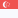

Instruments & Analysis  [https://bz.myuserhub.com/instruments]  

01. Forex  
	 AUDCAD  
	  [https://www.tradingview.com/symbols/AUDCAD/]  

	 AUDCHF   
	  [https://www.tradingview.com/symbols/AUDCHF/]  

	 AUDJPY  
	  [https://www.tradingview.com/symbols/AUDJPY/]  

	 AUDNZD  
	  [https://www.tradingview.com/symbols/AUDNZD/]  

	 AUDSGD  
	  [https://www.tradingview.com/symbols/AUDSGD/]  

	 AUDUSD  
	  [https://www.tradingview.com/symbols/AUDUSD/]  

	 CADCHF   
	  [https://www.tradingview.com/symbols/CADCHF/]  

	 CADJPY   
	  [https://www.tradingview.com/symbols/CADJPY/]  

	 CHFJPY  
	  [https://www.tradingview.com/symbols/CHFJPY/]  

	 EURAUD  
	  [https://www.tradingview.com/symbols/EURAUD/]  

	 EURCAD  
	  [https://www.tradingview.com/symbols/EURCAD/]  

	 EURCHF  
	  [https://www.tradingview.com/symbols/EURCHF/]  

	 EURGBP  
	  [https://www.tradingview.com/symbols/EURGBP/]  

	 EURJPY  
	  [https://www.tradingview.com/symbols/EURJPY/]  

	 EURNZD  
	  [https://www.tradingview.com/symbols/EURNZD/]  

	 EURPLN  
	  [https://www.tradingview.com/symbols/EURPLN/]  

	 EURSEK  
	  [https://www.tradingview.com/symbols/EURSEK/]  

	 EURSGD  
	  [https://www.tradingview.com/symbols/EURSGD/]  

	 EURTRY  
	  [https://www.tradingview.com/symbols/EURTRY/]  

	 EURUSD  
	  [https://www.tradingview.com/symbols/EURUSD/]  

	 GBPAUD  
	  [https://www.tradingview.com/symbols/GBPAUD/]  

	 GBPCAD  
	  [https://www.tradingview.com/symbols/GBPCAD/]  

	 GBPCHF  
	  [https://www.tradingview.com/symbols/GBPCHF/]  

	 GBPJPY  
	  [https://www.tradingview.com/symbols/GBPJPY/]  

	 GBPNZD  
	  [https://www.tradingview.com/symbols/GBPNZD/]  

	 GBPSEK  
	  [https://www.tradingview.com/symbols/GBPSEK/]  

	 GBPSGD  
	  [https://www.tradingview.com/symbols/GBPSGD/]  

	 GBPUSD  
	  [https://www.tradingview.com/symbols/GBPUSD/]  

	 NZDCAD  
	  [https://www.tradingview.com/symbols/NZDCAD/]  

	 NZDCHF  
	  [https://www.tradingview.com/symbols/NZDCHF/]  

	 NZDJPY  
	  [https://www.tradingview.com/symbols/NZDJPY/]  

	 NZDUSD  
	  [https://www.tradingview.com/symbols/NZDUSD/]  

	 SGDJPY  
	  [https://www.tradingview.com/symbols/SGDJPY/]  

	 USDBRL  
	  [https://www.tradingview.com/symbols/USDBRL/]  

	 USDCAD  
	  [https://www.tradingview.com/symbols/USDCAD/]  

	 USDCHF  
	  [https://www.tradingview.com/symbols/USDCHF/]  

	 USDCLP  
	  [https://www.tradingview.com/symbols/USDCLP/]  

	 USDDKK  
	  [https://www.tradingview.com/symbols/USDDKK/]  

	 USDHKD  
	  [https://www.tradingview.com/symbols/USDHKD/]  

	 USDHUF  
	  [https://www.tradingview.com/symbols/USDHUF/]  

	 USDILS  
	  [https://www.tradingview.com/symbols/USDILS/]  

	 USDJPY  
	  [https://www.tradingview.com/symbols/USDJPY/]  

	 USDMXN  
	  [https://www.tradingview.com/symbols/USDMXN/]  

	 USDNOK  
	  [https://www.tradingview.com/symbols/USDNOK/]  

	 USDPLN  
	  [https://www.tradingview.com/symbols/USDPLN/]  

	 USDSEK  
	  [https://www.tradingview.com/symbols/USDSEK/]  

	 USDSGD  
	  [https://www.tradingview.com/symbols/USDSGD/]  

	 USDTRY  
	  [https://www.tradingview.com/symbols/USDTRY/]  

	 USDZAR  
	  [https://www.tradingview.com/symbols/USDZAR/USDZAR]  

02. Metals  
	XAUUSD  
	  [https://www.tradingview.com/symbols/XAUUSD/]  
	  [https://en.wikipedia.org/wiki/Gold]  
	XAUEUR   
	  [https://www.tradingview.com/symbols/XAUEUR/]  
	XAUAUD   
	  [https://www.tradingview.com/symbols/XAUAUD/]  

	XAGUSD   
	  [https://www.tradingview.com/symbols/XAGUSD/]  
	XAGEUR   
	  [https://www.tradingview.com/symbols/XAGEUR/]  
	
	XPDUSD   
	  [https://en.wikipedia.org/wiki/Palladium]    
	  [https://www.tradingview.com/symbols/XPDUSD/]   

	XPTUSD   
	  [https://en.wikipedia.org/wiki/Platinum]  
	  [https://www.tradingview.com/symbols/XPTUSD/]  

03. Energies  
	BRENT  

	GASOLIN  
	  [https://en.wikipedia.org/wiki/Gasoline]  
	  
	HEATOIL  

	NATGAS  
	  [https://www.barchart.com/futures/quotes/NG&ast;0/futures-prices]

	UKBRENT  

	USCRUDE  

	WTICASH  

04. Indices  
	USINDX  
	  [https://www.tradingview.com/symbols/TVC-DXY/]  
	  [https://www.tradingview.com/symbols/DXY/]   
	US500  
	  [https://www.barchart.com/futures/quotes/ES&ast;0/futures-prices]  
	  [https://www.tradingview.com/symbols/ESU2023/]   
	US100  
	  [https://www.barchart.com/futures/quotes/NQ&ast;0/futures-prices]  
	  [https://www.tradingview.com/symbols/NQU2023/]   
	US30   
	  [https://www.barchart.com/futures/quotes/YM&ast;0/futures-prices]  
	  [https://www.tradingview.com/symbols/YMU2023/]   

	--European Indices  
	GER30   
	  [https://en.wikipedia.org/wiki/DAX]   
	  [https://www.barchart.com/futures/quotes/DY&ast;0/futures-prices]     
	  [https://www.tradingview.com/symbols/XETR-DAX/]   

	SWI20  
	  [https://en.wikipedia.org/wiki/Swiss_Market_Index]  
	  [https://www.barchart.com/futures/quotes/SZ&ast;0/futures-prices]    

	AUS200  
	  [https://en.wikipedia.org/wiki/S%26P/ASX_200]    
	  [https://www.tradingview.com/symbols/PEPPERSTONE-AUS200/]  

	AUST20  
      [https://en.wikipedia.org/wiki/Austrian_Traded_Index]  

	CHINA50  
	  [https://en.wikipedia.org/wiki/FTSE_China_A50_Index]  
	  [https://www.tradingview.com/symbols/SKILLING-CHINA50/]  

	EU50  
	  [https://en.wikipedia.org/wiki/EURO_STOXX_50]  
	  [https://www.barchart.com/futures/quotes/FX&ast;0/futures-prices]   
	  [https://www.tradingview.com/symbols/FOREXCOM-EU50/]  

	FRA40  
	  [https://en.wikipedia.org/wiki/CAC_40]
	  [https://www.barchart.com/futures/quotes/MX&ast;0/futures-prices]  
	  [https://www.tradingview.com/symbols/OANDA-FR40EUR/]  

	HK50  
      [https://en.wikipedia.org/wiki/Hang_Seng_China_50_Index]  
	  [https://www.tradingview.com/symbols/CAPITALCOM-HK50/]  

	JP225  
	  [https://en.wikipedia.org/wiki/Nikkei_225]  
	  [https://www.tradingview.com/symbols/TVC-NI225/]  

	UK100  
	  [https://en.wikipedia.org/wiki/FTSE_100_Index]  
	  [https://www.barchart.com/futures/quotes/X&ast;0/futures-prices]  
	  [https://www.tradingview.com/symbols/CAPITALCOM-UK100/]  

05. Shares  

06. ETFs  

07. Commodities  
	CORN  

	SOYBEAN  

	SUGAR  

	WHEAT  

08. Treasuries  
	  [https://en.wikipedia.org/wiki/Bond_market]  
	  [https://www.barchart.com/futures/quotes/ZB&ast;0/futures-prices]  
	  [https://www.tradingview.com/symbols/ZBU2023/]  

09. Crypto  
	BTCUSD  
      [https://en.wikipedia.org/wiki/Bitcoin]  
	  [https://www.tradingview.com/symbols/BTCUSD/]  

	ETHUSD  
      [https://en.wikipedia.org/wiki/Ethereum]  
	  [https://www.tradingview.com/symbols/ETHUSD/]  

	BCHUSD  
      [https://www.investopedia.com/tech/bitcoin-vs-bitcoin-cash-whats-difference/]  
	  [https://www.tradingview.com/symbols/BCHUSD/?exchange=BITSTAMP]  

	LTCUSD  
      [https://en.wikipedia.org/wiki/Litecoin]  
	  [https://www.tradingview.com/symbols/LTCUSD/]  

	XRPUSD  
	  [https://en.wikipedia.org/wiki/Ripple_(payment_protocol)]  
	  [https://www.tradingview.com/symbols/XRPUSD/]  

The Most Volatile Currency Pairs and How to Trade Them [https://www.dailyfx.com/education/volatility/most-volatile-currency-pairs.html]  
